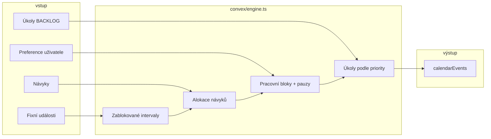

<div align="center">

# Chronos

**Inteligentní plánovač dne** — kalendář, projekty, návyky a automatické rozvržení v jednom tmavém dashboardu.

<br />

[](https://nextjs.org/)
[](https://react.dev/)
[](https://www.convex.dev/)
[](https://www.typescriptlang.org/)
[](https://tailwindcss.com/)

</div>

---

## Proč Chronos

Místo tří oddělených nástrojů (kalendář, to-do, habit tracker) dostaneš **jeden den na časové ose**: fixní schůzky, deep work bloky, návyky i pauzy. Engine vyplní volné sloty podle priorit a preferencí; ty jen doladíš přetažením nebo přepočtem zbytku dne.

| Oblast | Co umí |
|--------|--------|
| **Denní timeline** | Vlastní mřížka 6:00–22:00, 15min sloty, barevné typy (schůzka, deep work, návyk, pauza) |
| **Optimalizace dne** | Heuristický engine: návyky → pracovní bloky → úkoly z projektů → pauzy (~78 % kapacity) |
| **Projekty** | Úkoly, poznámky, snippety a odkazy v projektech; naplánování úkolu do kalendáře |
| **Návyky** | Denní/týdenní frekvence, streak, automatické zařazení do rána/odpoledne/večera |
| **Statistiky** | Efektivita dne, focus depth, konzistence návyků, export pracovního času |
| **Realtime** | Convex — změny se projeví všude okamžitě, bez reloadu |

---

## Náhled funkcí

```text
┌─────────────────────────────────────────────────────────────────┐
│  CHRONOS                                                        │
├──────────────┬──────────────────────────────────┬───────────────┤
│  Projekty    │  Denní timeline (drag & drop)     │  Metriky dne  │
│  · úkoly     │  · překryvy vedle sebe           │  · efektivita │
│  · poznámky  │  · živá čára „teď“               │  · optimaliz. │
│  · snippety  │  · banner při skluzu úkolů       │               │
│  · odkazy    │                                  │               │
├──────────────┴──────────────────────────────────┴───────────────┤
│  Návyky  ·  Statistiky  ·  Nastavení (focus okna, pauzy, …)   │
└─────────────────────────────────────────────────────────────────┘
```

---

## Rychlý start

### Požadavky

- **Node.js** 20+
- Účet na [Convex](https://www.convex.dev/) (lokální dev nebo cloud deployment)

### 1. Klonování a závislosti

```bash
git clone <repo-url> chronos
cd chronos
npm install
```

### 2. Convex

```bash
npx convex dev
```

Příkaz vytvoří nebo doplní `.env.local` (`CONVEX_DEPLOYMENT`, `NEXT_PUBLIC_CONVEX_URL`). Nech běžet na pozadí, nebo ho spusť v druhém terminálu.

### 3. Autentizace (jednorázově na deployment)

```bash
npm run setup:auth
```

Na Convex deployment nastaví `JWT_PRIVATE_KEY`, `JWKS` a `SITE_URL` (výchozí `http://localhost:3000`).

Pro nasazený frontend:

```bash
SITE_URL=https://tvoje-app.vercel.app npm run setup:auth
```

### 4. Vývoj

```bash
npm run dev
```

Spustí paralelně **Next.js** (`http://localhost:3000`) a **Convex dev**. Po přihlášení se vytvoří výchozí projekt a preference.

---

## Stránky aplikace

| Cesta | Popis |
|-------|--------|
| `/dashboard` | Hlavní přehled — timeline, panel úkolů, optimalizace dne |
| `/projects` | Seznam projektů |
| `/projects/[id]` | Workspace: poznámky, snippety, odkazy, úkoly |
| `/habits` | Správa a plnění návyků |
| `/analytics` | Grafy a timesheet pracovního času |
| `/schedule` | Alternativní pohled na rozvrh |
| `/backlog` | Přesměrování na `/projects` |

---

## Jak funguje plánování



- **Kapacita** cílí na ~78 % dne — záměrná rezerva na nepředvídané věci.
- **Flexibilní** události lze přesunout tažením v timeline (`moveToTime`).
- **Skluz** — pokud je po konci úkolu a není hotový, banner nabídne přepočet zbytku dne.

---

## Technologie

| Vrstva | Stack |
|--------|--------|
| Frontend | Next.js 16 (App Router), React 19, TypeScript |
| UI | Tailwind CSS 4, shadcn/ui (Radix), Lucide |
| Stav UI | Zustand (`selectedDate`, modaly, bannery) |
| Backend | Convex — queries, mutations, actions |
| Auth | [@convex-dev/auth](https://labs.convex.dev/auth) |
| Čas / layout | Vlastní timeline (`calendar-time`, `calendar-layout`) |

Vizuální systém **Cyber-Premium** je popsán v [`DESIGN.md`](./DESIGN.md).

---

## Struktura repozitáře

```text
chronos/
├── convex/              # Schéma, API, engine, auth
│   ├── schema.ts
│   ├── engine.ts        # Generování dne
│   ├── calendarEvents.ts
│   ├── tasks.ts
│   ├── projects.ts
│   └── …
├── src/
│   ├── app/             # Next.js routes
│   ├── components/      # UI (calendar, dashboard, projects, …)
│   ├── lib/             # Čas, layout kalendáře, kategorie práce
│   └── store/           # Zustand
├── scripts/
│   └── setup-convex-auth.mjs
└── DESIGN.md
```

---

## Proměnné prostředí

**Lokálně** (`.env.local` — vzor v [`.env.local.example`](./.env.local.example)):

| Proměnná | Kde | Popis |
|----------|-----|--------|
| `CONVEX_DEPLOYMENT` | `.env.local` | Deployment (dev / develop / prod) |
| `NEXT_PUBLIC_CONVEX_URL` | `.env.local` | URL Convex backendu |
| `JWT_PRIVATE_KEY` | Convex env | Klíč pro auth — `npm run setup:auth` |
| `JWKS` | Convex env | Veřejné klíče |
| `SITE_URL` | Convex env | URL frontendu (callback, odkazy) |

> Auth tajemství **nepatří** do `.env.local` frontendu — nastavují se na Convex deployment přes `setup:auth`.

---

## Skripty

| Příkaz | Účel |
|--------|------|
| `npm run dev` | Next.js + Convex dev paralelně |
| `npm run build` | Produkční build |
| `npm run start` | Spuštění po buildu |
| `npm run lint` | ESLint |
| `npm run setup:auth` | JWT + JWKS + SITE_URL na Convex |

---

## Datový model (zkráceně)

Hlavní tabulky v `convex/schema.ts`:

- **`calendarEvents`** — události dne (`EVENT`, `TASK`, `HABIT`, `BREAK`), volitelná `workCategory`
- **`tasks`** — úkoly v projektech, stavy `BACKLOG` / `SCHEDULED` / `DONE`
- **`projects`** + **`projectNotes`** / **`projectSnippets`** / **`projectLinks`**
- **`habits`** + **`habitCompletions`**
- **`userPreferences`** — cílové hodiny, délky bloků, focus okna

---

## Roadmap

- [x] Vlastní denní timeline a editace událostí
- [x] Heuristický plánovací engine
- [x] Projekty místo globálního backlogu
- [x] Kategorie práce a timesheet
- [x] Překryvy vedle sebe, drag času, detekce skluzu
- [ ] AI optimalizace dne (LLM nad JSON snapshotem dne)
- [ ] Týdenní / měsíční pohled kalendáře
- [ ] Mind mapy v projektech

---

## Pro vývojáře / agenty

- Konvence a kontext pro AI: [`AGENTS.md`](./AGENTS.md), [`CLAUDE.md`](./CLAUDE.md)
- Po změně schématu: `npx convex dev` (push schématu)
- Při chybě auth na cloudu: zkontroluj `CONVEX_DEPLOYMENT` a znovu `npm run setup:auth` s správným `SITE_URL`

---

<div align="center">

**Chronos** — čas pod kontrolou, den podle tebe.

</div>
